# SY_embedded

### Follow the following steps to submit codes

1. Forking the repository:
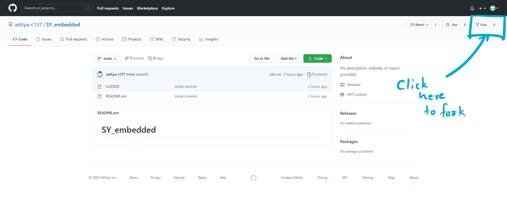

2. You'll see the same repository made under your account
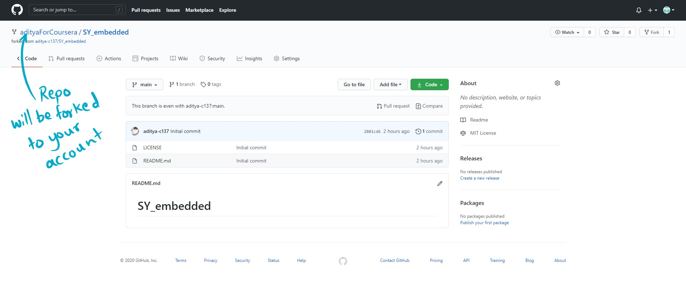

3. Now suppose you want to submit the code you wrote for DC motor on Arduino. DC motor is a type of **Actuator**
so click on `Arduino` and then on `Actuator`.

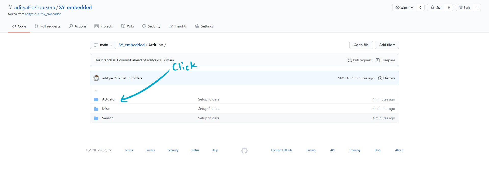

4. If the folder with your name does not exist you'll need to create the folder. **Empty folders can't be created in git.** To make a folder, go to `Add File -> create new file`:
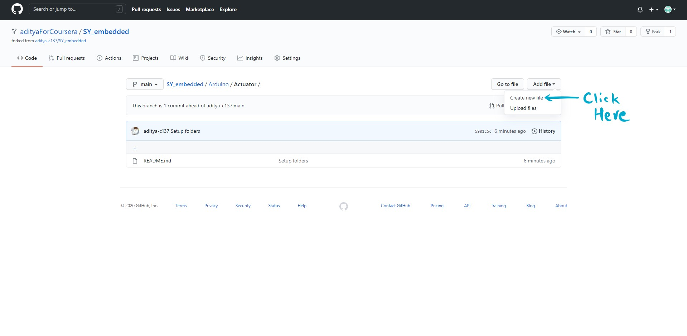

5. to make a folder write folder name (here your name in format: `firstName-lastName`) followed by a forward slash `/`
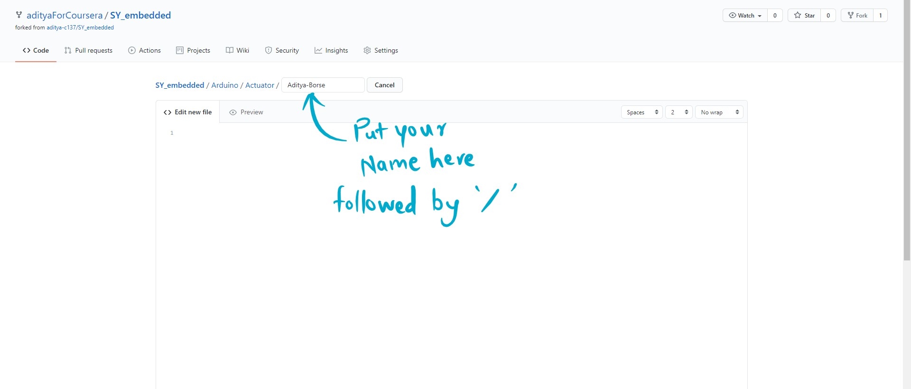

6. After this create a temporary file with some random content or code file with your code along with appropriate file extension (eg .ino, .c, .cpp etc)
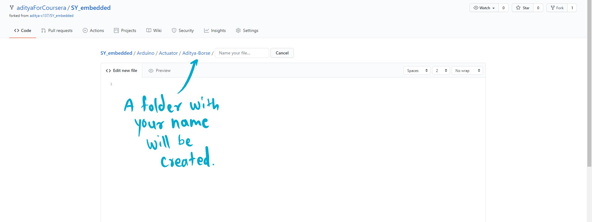

7. Scroll down to write a commit message and commit to main branch.
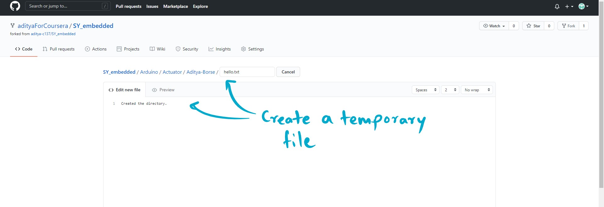

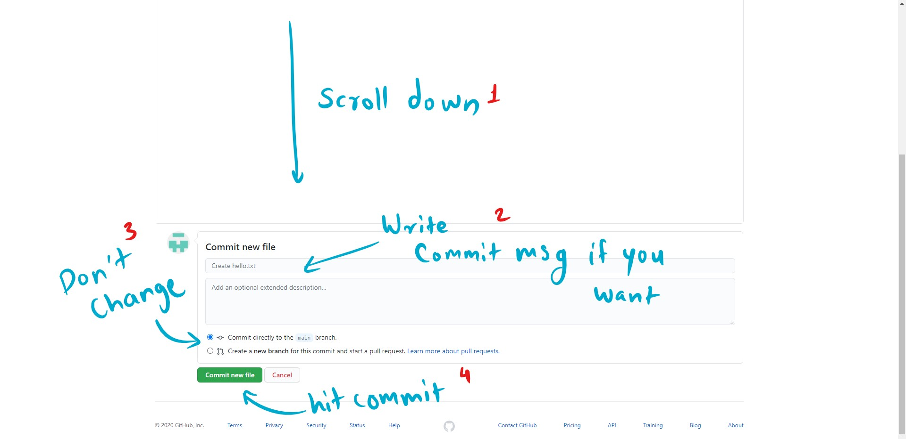

These were the steps to fork the main repository and create a folder with your name.

Next part is submitting code and uploading files.

1. Now you can traverse to the folder and upload your code files by `Add file->Upload files`
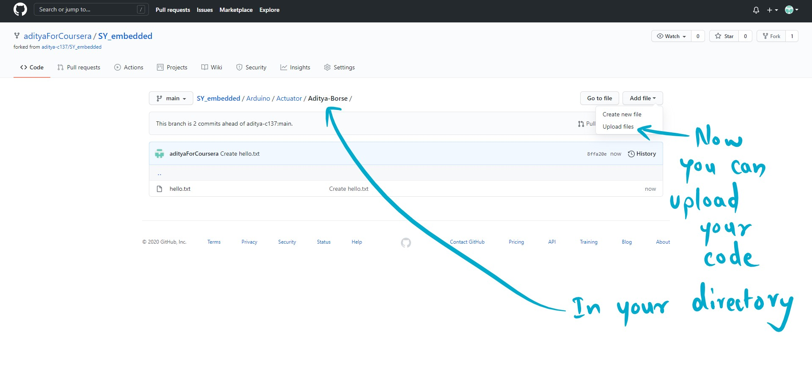

2. After uploading click on `Pull requests` tab

3. Click on `New pull request`
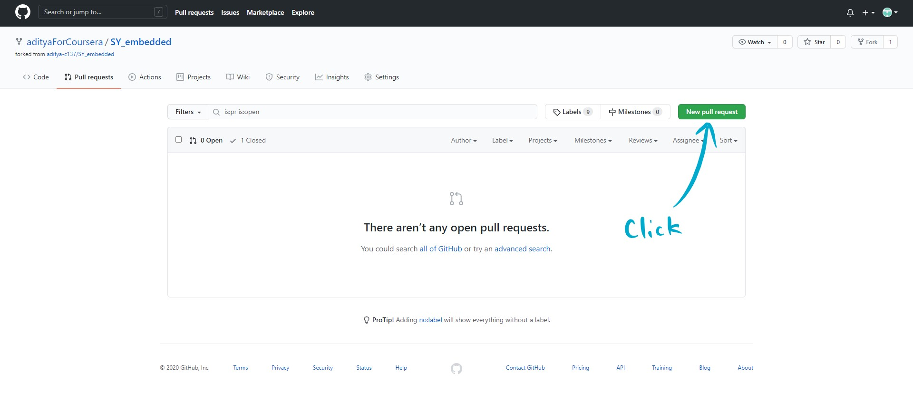

4. Make sure base repository is the repository you are merging to and head repository is your repository. Make sure the brances are correct. For simplicity's sake, we'll only use main branch. Then click on `Create pull request`:
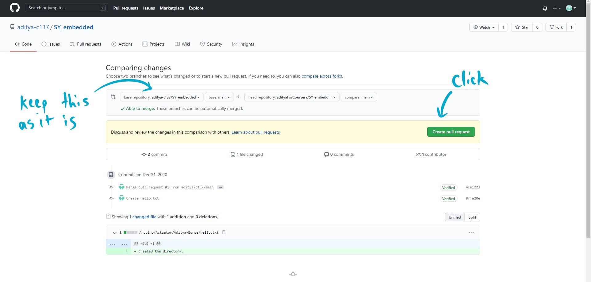

5. Write a commit message about the code that you are uploading and click on `Create pull request`
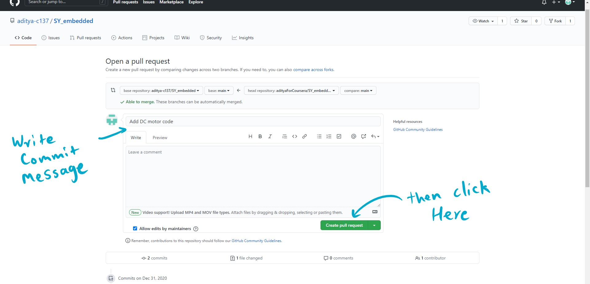

6. Done!
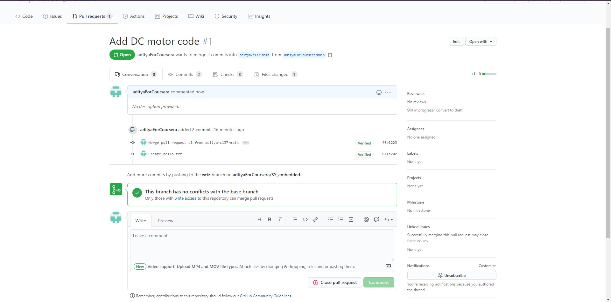
